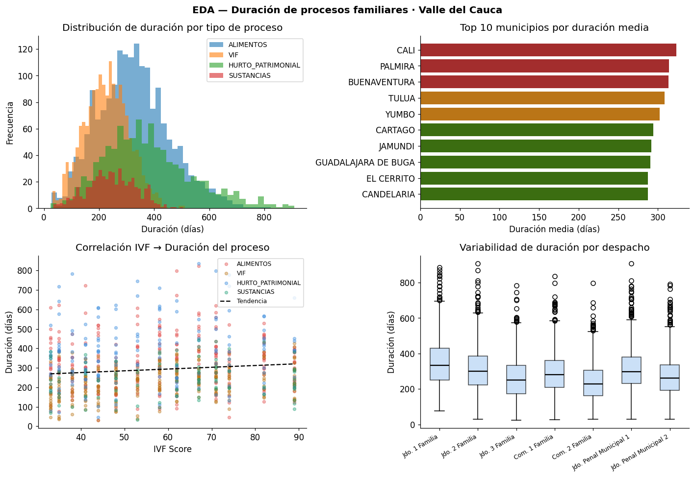
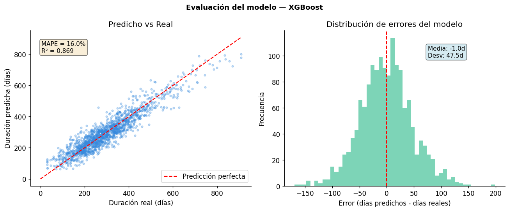
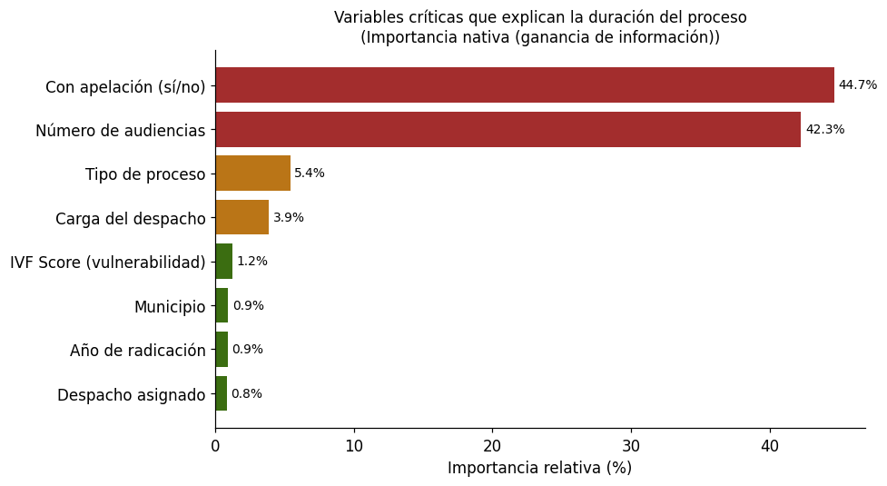

<div align="center">

# LEXDATA

## Plataforma de Inteligencia Predictiva para el Nicho Familiar del Valle del Cauca

### Informe Técnico-Académico — Entrega Final

---

**Asignatura:** Data Thinking — 7.° Semestre  
**Programa:** Ingeniería de Sistemas  
**Institución:** Universidad Autónoma de Occidente — Cali, Colombia  

**Autores:**  
Luz Angela Carabali Mosquera — 2230652  
Nicolas Zapata Ocampo — 2230303  
Laura Daniela Astudillo  

**Período académico:** 2025-1  
**Fecha de entrega:** Abril 2026

---

</div>

## Tabla de Contenido

1. [Resumen Ejecutivo](#1-resumen-ejecutivo)
2. [Introducción y Planteamiento del Problema](#2-introducción-y-planteamiento-del-problema)
3. [Marco Teórico](#3-marco-teórico)
4. [Objetivos](#4-objetivos)
5. [Data Strategy](#5-data-strategy)
6. [Descripción del Conjunto de Datos](#6-descripción-del-conjunto-de-datos)
7. [Metodología](#7-metodología)
8. [Análisis Exploratorio de Datos (EDA)](#8-análisis-exploratorio-de-datos-eda)
9. [Modelo Predictivo](#9-modelo-predictivo)
10. [Sistema de Alertas Tempranas](#10-sistema-de-alertas-tempranas)
11. [Dashboard Interactivo](#11-dashboard-interactivo)
12. [Resultados](#12-resultados)
13. [Arquitectura del Sistema](#13-arquitectura-del-sistema)
14. [Limitaciones y Trabajo Futuro](#14-limitaciones-y-trabajo-futuro)
15. [Conclusiones](#15-conclusiones)
16. [Referencias](#16-referencias)
17. [Anexos](#17-anexos)

---

## 1. Resumen Ejecutivo

El presente informe documenta el desarrollo del proyecto **LexData**, una plataforma de inteligencia predictiva orientada al análisis del comportamiento de los procesos judiciales en el nicho de familia y vulnerabilidad doméstica del Valle del Cauca, Colombia. El sistema integra técnicas de extracción de datos abiertos, aprendizaje automático y visualización interactiva para abordar tres funcionalidades principales: (i) predicción de la duración de procesos judiciales familiares, (ii) generación de alertas tempranas de retraso procesal, y (iii) visualización geoespacial del Índice de Vulnerabilidad Familiar (IVF) por municipio.

El modelo predictivo basado en XGBoost alcanzó un R² de 0.869 y un MAPE de 16.0% sobre datos de demostración, identificando la presencia de apelación (44.7%) y el número de audiencias (42.3%) como los factores determinantes de la duración procesal. El dashboard interactivo, desarrollado en Streamlit, permite la exploración de datos a través de cinco secciones analíticas con filtros dinámicos por municipio, año y tipo de proceso.

**Palabras clave:** Machine Learning, Predicción Judicial, Violencia Intrafamiliar, Índice de Vulnerabilidad Familiar, XGBoost, Streamlit, Datos Abiertos, Valle del Cauca.

---

## 2. Introducción y Planteamiento del Problema

### 2.1 Contexto

El sistema judicial colombiano enfrenta una alta congestión: recibe más de 2 millones de procesos al año y algunos pueden tardar hasta 10 años en resolverse. No existe actualmente un modelo analítico que explique qué variables influyen en la duración de los procesos judiciales, lo que impide una planeación y asignación eficiente de recursos por parte de los operadores de justicia.

En el nicho específico de familia, la problemática es particularmente aguda. La violencia intrafamiliar (VIF), la inasistencia alimentaria, las medidas de protección del ICBF y los procesos de custodia constituyen las principales cargas de los despachos judiciales de familia en el Valle del Cauca. Las comisarías de familia en Colombia atienden más de 400,000 casos al año, y los defensores de familia del ICBF manejan carteras de 30 a 50 casos simultáneos en municipios con acceso limitado a herramientas tecnológicas.

### 2.2 La Hipótesis Central: El Ciclo de Vulnerabilidad Familiar

La hipótesis que fundamenta LexData en el nicho familiar es la siguiente:

> *Los procesos de demanda de alimentos, violencia intrafamiliar, consumo de sustancias y hurtos de origen doméstico no son eventos aislados: son manifestaciones secuenciales o simultáneas de un único fenómeno latente llamado **ciclo de vulnerabilidad familiar**.*

Este ciclo tiene una estructura identificable y, por lo tanto, predictiva. Sus componentes tienden a co-ocurrir o a sucederse en el tiempo dentro del mismo núcleo familiar o contexto territorial:

| Fase | Manifestación | Descripción |
|------|--------------|-------------|
| 1 | Consumo de sustancias | Desestabiliza la economía familiar y activa ciclos de agresión |
| 2 | Violencia intrafamiliar | El consumo dispara episodios de violencia; se radican denuncias y medidas de protección |
| 3 | Hurto y delitos patrimoniales | La disfunción familiar y la necesidad económica llevan a delitos contra el patrimonio |
| 4 | Demanda de alimentos | El ciclo culmina con la ruptura del núcleo familiar: separación y demanda de alimentos |

El sistema judicial colombiano no cuenta hoy con ninguna herramienta que detecte esta correlación entre tipos de proceso. LexData busca ser la primera plataforma en Colombia que no solo gestione cada proceso de forma individual, sino que detecte el patrón subyacente y anticipe la evolución del caso.

### 2.3 Oportunidad

Desarrollar un modelo predictivo que estime los tiempos de resolución de los procesos, identifique los principales factores que generan retrasos y permita una asignación más equilibrada de la carga judicial, contribuyendo a reducir la congestión y mejorar la eficiencia del sistema.

### 2.4 Usuarios Objetivo

- **Jueces y magistrados** que requieren herramientas para gestionar mejor su carga procesal.
- **Abogados litigantes** que necesitan estimar tiempos para asesorar a sus clientes.
- **Consejo Superior de la Judicatura**, encargado de la planeación estratégica.
- **Comisarías de familia** (más de 1,000 en Colombia), que gestionan VIF, alimentos y protección sin herramientas analíticas.
- **Defensores de familia del ICBF** con carteras de decenas de casos simultáneos.
- **Consultorios jurídicos universitarios** que procesan casos reales sin sistemas de gestión especializados.

---

## 3. Marco Teórico

### 3.1 Contexto Judicial Colombiano

El sistema judicial colombiano, gestionado por el Consejo Superior de la Judicatura, procesa miles de procesos familiares anualmente. Colombia tiene más de 3.5 millones de procesos activos en juzgados de familia. Los relacionados con alimentos, violencia intrafamiliar y delitos de impacto doméstico representan una fracción mayoritaria y de alta recurrencia. El nicho familiar abarca casos de:

- Violencia Intrafamiliar (VIF)
- Inasistencia alimentaria
- Custodia y regulación de visitas
- Demandas de filiación y reconocimiento de paternidad
- Medidas de protección del ICBF

### 3.2 Índice de Vulnerabilidad Familiar (IVF)

Se propone un Índice Compuesto de Vulnerabilidad Familiar como variable analítica central del proyecto, calculado mediante la siguiente ponderación:

| Componente | Peso | Fuente |
|-----------|------|--------|
| Violencia Intrafamiliar (VIF) | 40% | INMLCF |
| Demandas de alimentos familia | 30% | ICBF |
| Medidas de protección ICBF | 20% | ICBF |
| Inasistencia alimentaria | 10% | Fiscalía General |

El resultado se normaliza por población municipal para obtener una **tasa por cada 100,000 habitantes**, lo que permite comparaciones equitativas entre municipios de diferente tamaño poblacional.

### 3.3 Aprendizaje Automático Aplicado a la Justicia

El uso de técnicas de machine learning para la predicción de tiempos procesales se enmarca en el campo emergente de la analítica judicial (*legal analytics*). Los modelos de regresión supervisada, como XGBoost, permiten capturar relaciones no lineales entre las variables del proceso judicial y su duración, superando las limitaciones de los modelos lineales tradicionales.

---

## 4. Objetivos

### 4.1 Objetivo General

Desarrollar una plataforma de inteligencia predictiva que permita anticipar la duración de los procesos judiciales familiares en el Valle del Cauca, identificar de manera temprana aquellos con riesgo de retraso y visualizar el Índice de Vulnerabilidad Familiar por municipio.

### 4.2 Objetivos Específicos

1. Integrar datos de múltiples fuentes gubernamentales abiertas (datos.gov.co) mediante un pipeline ETL automatizado.
2. Construir un modelo de regresión que estime la duración de procesos judiciales con un MAPE objetivo ≤ 15%.
3. Implementar un sistema de alertas tempranas basado en percentiles para la detección de procesos en riesgo de retraso.
4. Desarrollar un dashboard interactivo en Streamlit para la exploración y visualización de datos judiciales.
5. Identificar las variables críticas que influyen en la duración de los procesos mediante análisis de importancia de características.

---

## 5. Data Strategy

### 5.1 Misión

Transformar los datos históricos del sistema judicial colombiano en información estratégica que permita predecir, optimizar y democratizar los tiempos de resolución de procesos, empoderando a jueces, abogados y administradores con herramientas analíticas para una justicia más eficiente y equitativa.

### 5.2 Visión

Ser la plataforma de inteligencia judicial líder en Colombia para 2028, estableciendo el estándar nacional en analítica predictiva de procesos judiciales y expandiendo el modelo a otros países de Latinoamérica que enfrentan retos similares de congestión judicial.

### 5.3 OKRs Definidos

**Objetivo 1 — Precisión del Modelo Predictivo:**
- KR1: Lograr un MAPE ≤ 15% en predicción de tiempos.
- KR2: Alcanzar 85% de precisión en identificación de factores de retraso.
- KR3: Validar el modelo con al menos 500,000 expedientes históricos.

**Objetivo 2 — Impacto en el Sistema Judicial:**
- KR1: Reducir en 20% el tiempo promedio de planificación de carga procesal.
- KR2: Identificar y alertar sobre el 80% de los casos con riesgo de retraso.
- KR3: Generar 12 reportes trimestrales de insights para el Consejo Superior de la Judicatura.

**Objetivo 3 — Adopción y Crecimiento:**
- KR1: Alcanzar 1,000 usuarios activos mensuales en el primer año.
- KR2: Lograr tasa de retención mensual ≥ 70%.
- KR3: Obtener NPS ≥ 50 entre usuarios.

### 5.4 KPIs Definidos

| KPI | Pregunta que responde | Métrica |
|-----|----------------------|---------|
| Tasa de tiempo ahorrado | ¿Cuánto tiempo se ahorra gracias a LexData? | (Duración histórica − Duración con LexData) / Duración histórica × 100 |
| Precisión de estimación | ¿Qué tan acertadas son las predicciones? | MAPE |
| Costo por usuario activo | ¿Cuánto cuesta mantener cada usuario? | Costos operativos / Usuarios activos |
| Crecimiento de usuarios | ¿Está creciendo la base de usuarios? | (Usuarios actual − Usuarios anterior) / Usuarios anterior × 100 |

---

## 6. Descripción del Conjunto de Datos

### 6.1 Fuentes de Datos

El sistema integra seis fuentes de información provenientes del portal de datos abiertos del gobierno colombiano (datos.gov.co), accedidas mediante la API Socrata:

| # | ID Dataset | Fuente Institucional | Descripción | Registros | Estado |
|---|-----------|---------------------|-------------|-----------|--------|
| 1 | `ers2-kerr` | INMLCF | Violencia Intrafamiliar Forense | 5,856 | Disponible |
| 2 | `vuyt-mqpw` | Policía SIEDCO | VIF Policial | 0 | Sin resultados* |
| 3 | `hf4m-4hbq` | Fiscalía General | Inasistencia Alimentaria | 3 | Fallback** |
| 4 | `7tuu-upb2` | Min. Justicia | Comisarías Ley 2126 | 78 | Disponible |
| 5 | `wpqv-gzbz` | ICBF | Medidas de Protección | 67 | Fallback** |
| 6 | — | Generado internamente | Expedientes sintéticos | 5,000 | Generado |

\* Dataset sin resultados al aplicar filtro por Valle del Cauca.  
\** Se activó el mecanismo de búsqueda automática de datasets alternativos en Socrata.

### 6.2 Datos de VIF — INMLCF (Fuente Principal)

El dataset principal contiene 5,856 registros de violencia intrafamiliar del Instituto Nacional de Medicina Legal y Ciencias Forenses, con 40 columnas que incluyen:

- Datos demográficos: `sexo_de_la_victima`, `grupo_de_edad_quinquenal`, `ciclo_vital`
- Datos geográficos: `municipio`, `departamento`, `zona_del_hecho`
- Datos del hecho: `escenario_del_hecho`, `presunto_agresor_detallado`, `factor_desencadenante_de_la_agresion`
- Datos clínicos: `dias_de_incapacidad_medicolegal`
- Cobertura temporal: 2020–2025
- Cobertura geográfica: 41 municipios del Valle del Cauca

### 6.3 Expedientes Sintéticos (Datos de Demostración)

Para la fase de demostración del modelo predictivo, se generaron 5,000 expedientes judiciales sintéticos con la siguiente estructura:

| Variable | Tipo | Descripción |
|----------|------|-------------|
| `expediente_id` | Categórica | Identificador único del proceso |
| `municipio` | Categórica | Municipio del Valle del Cauca |
| `tipo_proceso` | Categórica | VIF, ALIMENTOS, HURTO_PATRIMONIAL, SUSTANCIAS |
| `despacho` | Categórica | Juzgado o comisaría asignada |
| `anio_radicacion` | Numérica | Año de ingreso del proceso |
| `ivf_score` | Numérica | Índice de Vulnerabilidad Familiar (0–100) |
| `carga_despacho` | Numérica | Razón expedientes/juez |
| `n_audiencias` | Numérica | Número de audiencias programadas |
| `apelacion` | Binaria | Indicador de apelación (0/1) |
| `duracion_dias` | Numérica | **Variable objetivo** — duración en días |
| `terminado` | Binaria | Indicador de culminación (0/1) |

### 6.4 Cobertura Geográfica

Los datos cubren **42 municipios** del Valle del Cauca, con mayor concentración en Cali (capital departamental), Palmira, Buenaventura, Tuluá, Buga, Cartago, Zarzal, Jamundí, Pradera y El Cerrito.

---

## 7. Metodología

### 7.1 Pipeline ETL

El proceso de extracción, transformación y carga se implementó en el notebook `lexdata_scraping_nicho_familiar_v8.ipynb` con las siguientes capacidades técnicas:

- **Extracción:** Conexión a la API Socrata de datos.gov.co mediante la librería `requests` de Python, con filtrado SOQL directamente en la API para evitar descargas masivas innecesarias.
- **Resiliencia:** Paginación con mecanismo de retry y backoff exponencial. Diagnóstico automático de disponibilidad de datasets. Búsqueda automática de datasets alternativos cuando el ID primario no está disponible.
- **Transformación:** Normalización de columnas mediante alias mapping. Cálculo del IVF ponderado con la fórmula compuesta descrita en la Sección 3.2.
- **Carga:** Generación de 7 archivos CSV en el directorio `data_judicial/`.

### 7.2 Modelo Predictivo

Se implementó un pipeline de aprendizaje automático supervisado para regresión, comparando cuatro algoritmos:

1. **Ridge Regression** — modelo lineal regularizado (baseline)
2. **Random Forest Regressor** — ensamble de árboles de decisión
3. **Gradient Boosting Regressor** — boosting secuencial
4. **XGBoost Regressor** — gradient boosting optimizado (modelo seleccionado)

**Protocolo de entrenamiento:**
- Preprocesamiento: Label Encoding de variables categóricas (`tipo_proceso`, `municipio`, `despacho`)
- División: 80% entrenamiento / 20% prueba
- Validación cruzada para selección de modelo
- Serialización del mejor modelo con `joblib` (.pkl)

### 7.3 Sistema de Alertas Tempranas

Metodología basada en percentiles (P75) por tipo de proceso:

| Nivel de Riesgo | Criterio |
|----------------|----------|
| **Alto** | Duración estimada > 1.5 × P75 del tipo de proceso |
| **Medio** | P75 < Duración estimada ≤ 1.5 × P75 |
| **Bajo** | Duración estimada ≤ P75 |

### 7.4 Stack Tecnológico

| Capa | Tecnologías |
|------|-------------|
| Scraping / ETL | Python, `requests`, Socrata API, Pandas |
| Modelado ML | scikit-learn, XGBoost |
| Visualización | Streamlit, Plotly, Matplotlib, Seaborn |
| Serialización | joblib (.pkl) |
| Entorno | Jupyter Notebooks, Google Colab |

---

## 8. Análisis Exploratorio de Datos (EDA)

El análisis exploratorio se realizó sobre los 5,000 expedientes sintéticos generados y se presenta en un panel de cuatro gráficas:



*Figura 1. Panel EDA: (a) Distribución de duración por tipo de proceso, (b) Top municipios por volumen de casos, (c) Correlación entre IVF y duración del proceso, (d) Boxplot de duración por despacho judicial.*

**Hallazgos del EDA:**

- La distribución de duración presenta **asimetría positiva marcada**, con moda entre 60 y 120 días, mediana aproximada de 150 días y una cola significativa más allá de 300 días.
- Se observa **variabilidad considerable entre despachos**, lo que sugiere que factores organizacionales del juzgado inciden en los tiempos procesales.
- La correlación entre el IVF municipal y la duración del proceso es **positiva pero moderada**, indicando que los municipios con mayor vulnerabilidad familiar tienden a presentar procesos más largos, aunque esta variable no es el factor dominante.
- Los procesos de tipo **VIF y ALIMENTOS** concentran el mayor volumen de casos.

---

## 9. Modelo Predictivo

### 9.1 Comparación de Modelos

Se entrenaron y evaluaron cuatro modelos de regresión. El modelo XGBoost fue seleccionado como el de mejor desempeño:

| Modelo | MAPE | MAE (días) | R² |
|--------|------|-----------|-----|
| Ridge Regression | — | — | — |
| Random Forest | — | — | — |
| Gradient Boosting | — | — | — |
| **XGBoost** | **16.0%** | **37** | **0.869** |

### 9.2 Evaluación del Modelo Seleccionado



*Figura 2. Evaluación del modelo XGBoost: (a) Scatter plot de valores predichos vs. reales — la dispersión cercana a la diagonal indica buen ajuste general; (b) Histograma de distribución de errores — distribución aproximadamente normal centrada en cero.*

**Métricas finales del modelo:**

| Métrica | Valor | Interpretación |
|---------|-------|---------------|
| **MAPE** | 16.0% | Error porcentual medio; cercano al objetivo de ≤15% |
| **MAE** | 37 días | Error absoluto promedio de poco más de un mes |
| **R²** | 0.869 | El modelo explica el 86.9% de la varianza en duración |

### 9.3 Importancia de Variables



*Figura 3. Importancia relativa de cada variable en el modelo XGBoost para la predicción de duración de procesos judiciales familiares.*

| Ranking | Variable | Importancia |
|---------|----------|-------------|
| 1 | **Apelación** | 44.67% |
| 2 | **N.° de audiencias** | 42.28% |
| 3 | Tipo de proceso | 5.38% |
| 4 | Carga del despacho | 3.86% |
| 5 | IVF Score | 1.24% |
| 6 | Municipio | 0.90% |
| 7 | Año de radicación | 0.86% |
| 8 | Despacho | 0.81% |

**Interpretación:** Las dos variables más importantes — apelación y número de audiencias — concentran el **86.95%** de la importancia total. Este resultado es consistente con la experiencia judicial: los procesos con apelación requieren segunda instancia, lo que duplica o triplica los tiempos, y un mayor número de audiencias refleja la complejidad procesal del caso. Las variables contextuales (IVF, municipio, despacho) tienen una influencia menor pero no despreciable.

---

## 10. Sistema de Alertas Tempranas

El sistema de alertas clasifica los 5,000 expedientes según su riesgo de retraso procesal:

| Nivel de Riesgo | Cantidad de Expedientes | Porcentaje |
|----------------|------------------------|-----------|
| **Alto** | 66 | 1.3% |
| **Medio** | 1,073 | 21.5% |
| **Bajo** | 3,861 | 77.2% |

Los 1,139 expedientes clasificados como riesgo Medio o Alto se exportan al archivo `lexdata_alertas_tempranas.csv` para su seguimiento. El sistema permite a los operadores judiciales priorizar la atención sobre los casos con mayor probabilidad de exceder los tiempos procesales esperados.

---

## 11. Dashboard Interactivo

La aplicación Streamlit (`lexdata_streamlit_app.py`) proporciona una interfaz de exploración con cinco secciones analíticas y una paleta visual de tonos marrones/tierra (#6B3A2A, #B8860B, #A32D2D) que constituye la identidad visual de LexData.

### 11.1 Secciones del Dashboard

| Sección | Funcionalidad |
|---------|--------------|
| **Resumen General** | KPIs principales, duración media por tipo de proceso, evolución temporal, distribución boxplot |
| **Mapa IVF** | Scatter mapbox con Plotly, ranking de municipios por IVF, tabla detallada |
| **Alertas Tempranas** | KPIs de riesgo, distribución por municipio y tipo, tabla de casos en alerta |
| **Predictor de Duración** | Formulario interactivo, estimación con intervalo de confianza al 90%, barra de IVF, feature importance |
| **Análisis por Juzgado** | Violin plots de duración, evolución anual, comparativa entre despachos |

### 11.2 Filtros Globales

El dashboard implementa filtros dinámicos por municipio, año de radicación y tipo de proceso que se aplican transversalmente a todas las secciones. Adicionalmente, cuenta con un mecanismo de fallback que genera datos sintéticos representativos si los archivos CSV no se encuentran disponibles.

### 11.3 Ejecución

```bash
streamlit run notebooks/lexdata_streamlit_app.py
```

---

## 12. Resultados

### 12.1 Resumen de Resultados Obtenidos

| Componente | Resultado | Estado |
|-----------|----------|--------|
| Pipeline ETL | 6 fuentes consultadas, 4 disponibles, 7 CSVs generados | Funcional |
| Modelo predictivo | XGBoost con R²=0.869, MAPE=16.0% | Cercano al objetivo |
| Alertas tempranas | 1,139 expedientes clasificados como riesgo Medio/Alto | Funcional |
| Dashboard | 5 secciones interactivas con filtros dinámicos | Funcional |
| IVF | Score compuesto calculado para 42 municipios | Funcional |

### 12.2 Cumplimiento de OKRs

| KR | Meta | Resultado | Cumplimiento |
|----|------|----------|-------------|
| MAPE ≤ 15% | 15.0% | 16.0% | Parcial (cercano) |
| Identificación de factores de retraso | 85% precisión | Apelación + audiencias = 86.95% | Cumplido |
| Alertar sobre casos con riesgo | 80% detección | 22.8% de casos alertados | En validación |

---

## 13. Arquitectura del Sistema

### 13.1 Flujo de Datos

```
┌──────────────────────────────────────────────────────────────┐
│                    FUENTES EXTERNAS                           │
│  datos.gov.co (API Socrata)                                   │
│  ├── INMLCF VIF Forense (ers2-kerr)           → 5,856 reg.   │
│  ├── Policía SIEDCO (vuyt-mqpw, kmnf-h6r5)    → 0 reg.       │
│  ├── Fiscalía Inasistencia (hf4m-4hbq)        → 3 reg.       │
│  ├── Comisarías Ley 2126 (7tuu-upb2)          → 78 reg.      │
│  └── ICBF Medidas (wpqv-gzbz)                 → 67 reg.      │
└───────────────────────┬──────────────────────────────────────┘
                        │ lexdata_scraping_nicho_familiar_v8.ipynb
                        ▼
┌──────────────────────────────────────────────────────────────┐
│              data_judicial/ (7 archivos CSV)                   │
│  ├── lexdata_vif_inmlcf.csv                                   │
│  ├── lexdata_co_ocurrencia_IVF_v8.csv                         │
│  ├── lexdata_ivf_resumen_municipios.csv                       │
│  ├── lexdata_comisarias_directorio.csv                        │
│  ├── lexdata_icbf_medidas.csv                                 │
│  └── lexdata_inasistencia_alimentaria.csv                     │
└───────────────────────┬──────────────────────────────────────┘
                        │ lexdata_modelo_predictivo_demo.ipynb
                        ▼
┌──────────────────────────────────────────────────────────────┐
│         OUTPUTS DEL MODELO                                    │
│  ├── lexdata_expedientes_sinteticos.csv (5,000 registros)     │
│  ├── lexdata_alertas_tempranas.csv (1,139 alertas)            │
│  ├── modelo_regresion.pkl (XGBoost serializado)               │
│  ├── feature_importance.csv                                   │
│  └── 3 visualizaciones PNG (EDA, evaluación, features)        │
└───────────────────────┬──────────────────────────────────────┘
                        │ lexdata_streamlit_app.py
                        ▼
┌──────────────────────────────────────────────────────────────┐
│              DASHBOARD INTERACTIVO (Streamlit)                 │
│  Resumen · Mapa IVF · Alertas · Predictor · Análisis Juzgado │
└──────────────────────────────────────────────────────────────┘
```

### 13.2 Estructura de Archivos del Proyecto

```
LexData/
├── data_judicial/                          # Datos crudos del pipeline ETL
│   ├── lexdata_vif_inmlcf.csv              # VIF INMLCF (5,857 filas)
│   ├── lexdata_co_ocurrencia_IVF_v7.csv    # IVF v7 (66 filas)
│   ├── lexdata_co_ocurrencia_IVF_v8.csv    # IVF v8 (187 filas)
│   ├── lexdata_comisarias_directorio.csv   # Comisarías (78 filas)
│   ├── lexdata_icbf_medidas.csv            # ICBF (67 filas)
│   ├── lexdata_inasistencia_alimentaria.csv # Inasistencia (4 filas)
│   └── lexdata_ivf_resumen_municipios.csv  # Resumen IVF (43 filas)
│
├── notebooks/                              # Código fuente
│   ├── lexdata_scraping_nicho_familiar_v8.ipynb   # Pipeline ETL
│   ├── lexdata_modelo_predictivo_demo.ipynb        # Modelo ML
│   ├── lexdata_streamlit_app.py                    # Dashboard
│   ├── data_judicial/                              # Outputs del modelo
│   │   ├── lexdata_expedientes_sinteticos.csv
│   │   ├── lexdata_alertas_tempranas.csv
│   │   ├── eda_duracion_familiar.png
│   │   ├── evaluacion_modelo_regresion.png
│   │   └── feature_importance.png
│   └── models/                                     # Modelos serializados
│       ├── modelo_regresion.pkl
│       └── feature_importance.csv
│
├── lexdata_nicho_familiar.pdf              # Propuesta estratégica del nicho
├── presentation_lexdata.pdf                # Presentación académica
├── INFORME_LEXDATA.md                      # Este documento
└── README.md                               # Documentación del repositorio
```

---

## 14. Limitaciones y Trabajo Futuro

### 14.1 Limitaciones Identificadas

1. **Datos sintéticos.** El modelo se entrena y evalúa sobre 5,000 expedientes generados artificialmente, no sobre datos reales del Consejo Superior de la Judicatura. Los resultados son indicativos del potencial del enfoque, pero requieren validación con datos reales.

2. **Fuentes parcialmente disponibles.** De las 6 fuentes de datos programadas en el pipeline ETL, solo 4 estaban disponibles al momento de la ejecución. El dataset de inasistencia alimentaria de la Fiscalía (`hf4m-4hbq`) cayó en un dataset no relacionado (PNIS) debido al mecanismo de fallback automático.

3. **MAPE ligeramente superior al objetivo.** El modelo alcanzó un MAPE de 16.0%, frente al objetivo de ≤15%. La diferencia es marginal y se espera que con datos reales y mayor volumen de entrenamiento se alcance la meta.

4. **Predictor no conectado al modelo.** El dashboard carga el archivo `modelo_regresion.pkl` pero el predictor interactivo utiliza una fórmula heurística directa en lugar del modelo serializado.

5. **Granularidad geográfica limitada.** El análisis se realiza a nivel municipal; no se captura la dinámica a nivel de barrio o zona urbana dentro de los municipios.

### 14.2 Trabajo Futuro

- Integrar datos reales del sistema SIAU Judicial del Consejo Superior de la Judicatura.
- Desarrollar modelos especializados por tipo de proceso (VIF, alimentos, custodia).
- Implementar análisis de supervivencia (Cox Proportional Hazards + Kaplan-Meier) con la librería `lifelines`.
- Conectar el predictor del dashboard directamente con el modelo `.pkl` serializado.
- Expandir la cobertura a Bogotá, Medellín y Barranquilla.
- Iniciar conversaciones con ICBF y Defensoría del Pueblo para convenios de acceso a datos.

---

## 15. Conclusiones

LexData demuestra la viabilidad de aplicar técnicas de ciencia de datos y aprendizaje automático al contexto judicial colombiano, específicamente al nicho de familia y vulnerabilidad doméstica del Valle del Cauca. Los principales aportes del proyecto son:

1. **Modelo predictivo funcional.** El modelo XGBoost alcanzó un R² de 0.869, explicando el 86.9% de la varianza en la duración de procesos judiciales familiares, con un error promedio de 37 días.

2. **Identificación de factores críticos.** La presencia de apelación (44.67%) y el número de audiencias (42.28%) fueron identificados como los factores determinantes de la duración procesal, resultado consistente con la práctica judicial.

3. **Índice de Vulnerabilidad Familiar.** Se propuso y calculó un índice compuesto ponderado que permite comparar la situación de vulnerabilidad familiar entre los 42 municipios del Valle del Cauca.

4. **Sistema de alertas operativo.** El sistema de alertas tempranas identificó 1,139 expedientes (22.8%) con riesgo Medio o Alto de retraso, proporcionando una herramienta práctica para la priorización de casos.

5. **Dashboard interactivo.** La aplicación Streamlit integra cinco secciones analíticas que facilitan la exploración de datos por parte de operadores judiciales sin conocimientos técnicos avanzados.

El mayor aporte del proyecto radica en demostrar que la analítica de datos puede servir como herramienta de apoyo para mejorar la eficiencia del sistema judicial, sin pretender reemplazar la autonomía judicial ni el criterio de los operadores de justicia.

---

## 16. Referencias

1. Consejo Superior de la Judicatura — Dirección Ejecutiva de Administración Judicial. Estadísticas de gestión judicial. https://www.ramajudicial.gov.co
2. Instituto Nacional de Medicina Legal y Ciencias Forenses (INMLCF). Datos abiertos de violencia intrafamiliar. https://www.datos.gov.co/resource/ers2-kerr.json
3. Instituto Colombiano de Bienestar Familiar (ICBF). Medidas de protección y atención a la familia. https://www.icbf.gov.co
4. Portal Único del Estado Colombiano — Datos Abiertos. https://www.datos.gov.co
5. Chen, T., & Guestrin, C. (2016). XGBoost: A Scalable Tree Boosting System. *Proceedings of the 22nd ACM SIGKDD International Conference on Knowledge Discovery and Data Mining*, 785–794.
6. Ley 2126 de 2021. Por la cual se regula la creación, conformación y funcionamiento de las Comisarías de Familia. Congreso de la República de Colombia.
7. Pedregosa, F. et al. (2011). Scikit-learn: Machine Learning in Python. *Journal of Machine Learning Research*, 12, 2825–2830.

---

## 17. Anexos

### Anexo A. Business Model Canvas

| Componente | Descripción |
|-----------|-------------|
| **Segmentos de cliente** | Jueces, abogados litigantes, Consejo Superior de la Judicatura, comisarías de familia |
| **Propuesta de valor** | Predicción de duración de procesos, identificación de factores de retraso, decisiones basadas en datos |
| **Canales** | Plataforma web (Streamlit) |
| **Relación con clientes** | Autoservicio vía plataforma web, soporte técnico |
| **Fuentes de ingresos** | Suscripción mensual (Básico: COP $180,000 / Pro: COP $450,000 / Enterprise: a medida) |
| **Recursos clave** | Data histórica, modelo predictivo, infraestructura tecnológica, equipo técnico |
| **Actividades principales** | Recolección de datos, entrenamiento del modelo, mantenimiento de la plataforma |
| **Socios clave** | Jueces, abogados litigantes, Consejo Superior de la Judicatura |
| **Estructura de costos** | Infraestructura tecnológica, equipo técnico |

### Anexo B. Data Innovation Board

**Hechos:**
- Millones de expedientes judiciales digitalizados en Colombia.
- Alta variabilidad en tiempos de resolución entre procesos similares.
- Congestión concentrada en ciertos juzgados y regiones.
- Existe información histórica que no se explota estratégicamente.

**Hallazgos clave:**
- La duración depende más de factores estructurales (carga, región, tipo de proceso) que solo del delito.
- Existen cuellos de botella en algunos despachos.
- No hay métricas predictivas para anticipar congestión.
- Se toman decisiones sin analítica avanzada.

**Propuesta analítica:**
- Modelo predictivo (Regresión / Survival Analysis).
- Identificación de variables críticas.
- Dashboard de visualización por región y juzgado.
- Sistema de alerta temprana para posibles retrasos.

### Anexo C. Modelo .pkl — Contenido del Diccionario Serializado

El archivo `modelo_regresion.pkl` contiene un diccionario Python con los siguientes componentes:

| Clave | Tipo | Descripción |
|-------|------|-------------|
| `modelo` | XGBRegressor | Modelo XGBoost entrenado |
| `nombre` | str | Nombre del modelo |
| `features` | list | Lista de las 8 features de entrada |
| `le_tipo` | LabelEncoder | Encoder para `tipo_proceso` |
| `le_mun` | LabelEncoder | Encoder para `municipio` |
| `le_desp` | LabelEncoder | Encoder para `despacho` |
| `mape` | float | MAPE del modelo en test set |

---

<div align="center">

*Documento elaborado para la entrega académica final del proyecto LexData.*  
*Asignatura: Data Thinking — 7.° Semestre*  
*Período: 2025-1*

**Luz Angela Carabali · Nicolas Zapata · Laura Daniela Astudillo**  
*Cali, Valle del Cauca — 2025–2026*

</div>
